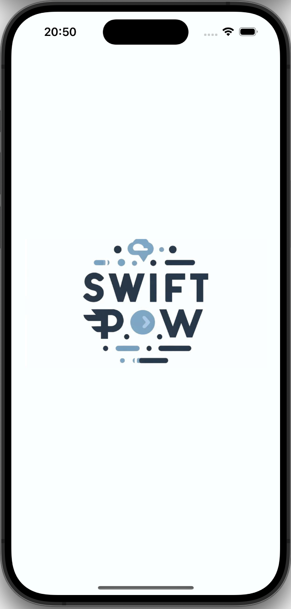

# App Login

## 📒 About Project

Login and registration application developed with native technologies such as swift, uikit and crud connections with firebase

## 🛠️ Technologies and Tools
- Swift
- Uikit
- Firebase
- MVVM architecture
- Coordinator

## ▶️ Features
- Sign In
- Sign Up
- Navigation between screens

### 📱 App Screenshots

|       🍏       |              SplashScreen               |              Sign Up               | Sign In                           | Home                            |
| :------------: | :----------------------------------------: | :---------------------------------------: | -------------------------------------- | ------------------------------------- |
| Screens |  |  |  | 

## ✨ Authors
<!-- ALL-CONTRIBUTORS-LIST:START - Do not remove or modify this section -->
<!-- prettier-ignore-start -->
<!-- markdownlint-disable -->
<table>
  <tr>
    <td align="center">
      <a href="https://github.com/JoaoPedroVolponi">
        
         
        
          <b>João Pedro Volponi</b>
        
      </a>
       
    </td>
    <td align="center">
      <a href="https://github.com/Luizrebelatto">
        
         
        
          <b>Luiz Gabriel Rebelatto</b>
        
      </a>
       
    </td>
  </tr>
</table>

<!-- markdownlint-enable -->
<!-- prettier-ignore-end -->
<!-- ALL-CONTRIBUTORS-LIST:END -->
